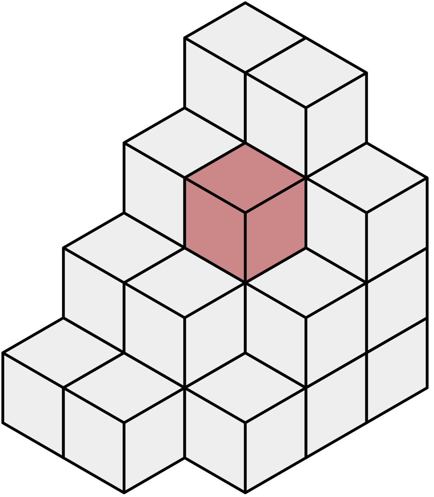
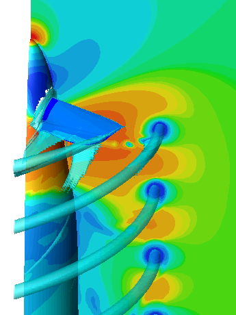
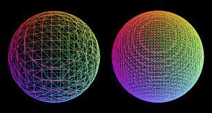

# 3D Reconstruction with Marching Cubes and OpenGL Voxels

This document presents a comprehensive research on 3D reconstruction using the Marching Cubes algorithm and OpenGL voxels. It also provides definitions of the key concepts involved in the process and discusses potential solutions to the issues that may arise.

## Definitions

1. **Voxel**: A voxel is the three-dimensional equivalent of a pixel. It represents a value in a regular grid in 3D space. This is used in computer graphics to represent a 3D object, just like a pixel represents a 2D object in an image [Source 0](https://stackoverflow.com/questions/7854498/triangulating-a-set-of-voxels).
   

2. **Chunk**: A chunk often refers to a piece or section of a larger 3D environment. This environment could be a game world or any other 3D space. Chunks are used to manage and render only the parts of the world that are currently needed [Source 2](https://transvoxel.org/).

3. **Triangulation**: Triangulation is the process of dividing a geometric surface into triangles. This is done because a triangle is a simple shape that is easy to work with and can be used to approximate more complex shapes [Source 0](https://stackoverflow.com/questions/7854498/triangulating-a-set-of-voxels).

4. **Isosurface**: An isosurface is a three-dimensional analog of an isoline. It is a surface that represents points of a constant value within a volume of space; in other words, it is a level set of a continuous function whose domain is 3-space [Source 4](https://en.wikipedia.org/wiki/Isosurface).
   

5. **Marching Cubes**: Marching cubes is a computer graphics algorithm for extracting a polygonal mesh of an isosurface from a three-dimensional discrete scalar field (the elements of which are sometimes called voxels) [Source 1](https://en.wikipedia.org/wiki/Marching_cubes).
   

## Problems and Solutions

1. **Isosurfaces and defining whether the point is internal, external, or on the edge**: Marching Cubes is an algorithm for rendering isosurfaces in volumetric data. It defines a voxel(cube) by the pixel values at the eight corners of the cube. By determining which edges of the cube are intersected by the isosurface, triangular patches can be created which divide the cube between regions within the isosurface and regions outside [Source 0](http://www.paulbourke.net/geometry/polygonise/).

2. **Triangulation with Graham and Jarvis algorithms**: The Graham's Scan and Jarvis's algorithm can be adapted for triangulation. Graham's Scan algorithm discussed [here](https://www.geeksforgeeks.org/convex-hull-set-2-graham-scan/) and Jarvis's algorithm discussed [here](https://www.geeksforgeeks.org/gift-wrapping-jarviss-algorithm-convex-hull/) could be useful.

3. **Moving and state objects, the problem when the object is filmed from different angles**: SLAM (Simultaneous Localization and Mapping) techniques can be used for handling moving objects and varying camera perspectives. The Open3D library provides a [reconstruction system](http://www.open3d.org/docs/release/tutorial/reconstruction_system/index.html) that could be useful [Source 3](http://www.open3d.org/docs/release/tutorial/reconstruction_system/index.html).

4. **Connecting isosurfaces**: The process of connecting isosurfaces is integral to the Marching Cubes algorithm. The algorithm creates triangular patches for each voxel that contribute to the isosurface, and by connecting these patches from all cubes on the isosurface boundary, a surface representation is obtained [Source 0](http://www.paulbourke.net/geometry/polygonise/).

5. **Understanding what problems the Marching Cubes algorithm solves**: The Marching Cubes algorithm is used to render isosurfaces in volumetric data. It helps in extracting a polygonal mesh of an isosurface from a three-dimensional scalar field (or 3D image data). It is widely used in 3D medical imaging to extract surface geometry from data such as CT or MRI scans [Source 1](https://en.wikipedia.org/wiki
